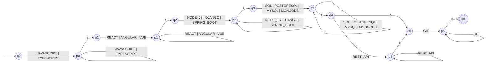
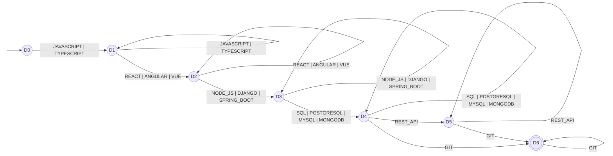
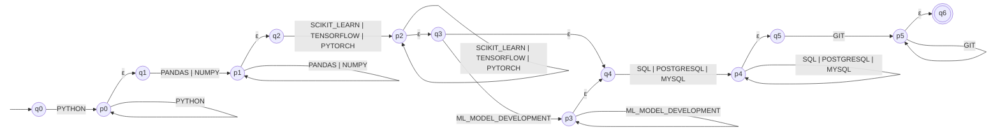
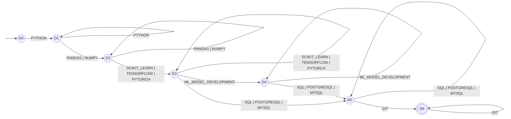
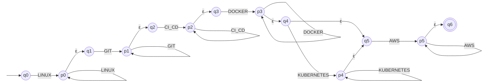
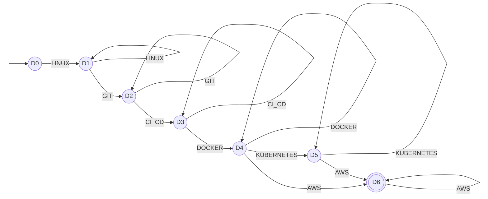
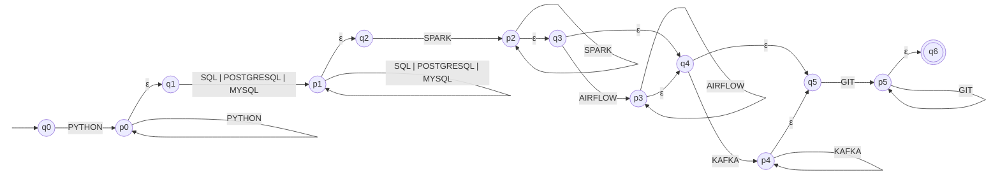
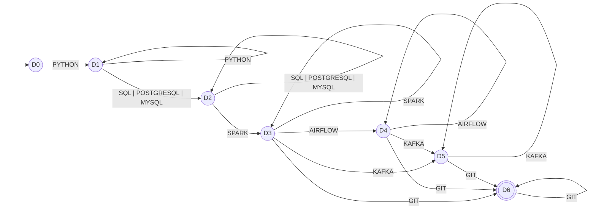

# Stage 3 automata — transition diagrams

Generated by `scripts/export_diagrams.py` from the automata in `src/resumelens/recognition.py`. Do not edit by hand.

For every profile two equivalent automata are shown: the ε-NFA built directly from the profile slots, and the minimal DFA obtained by subset construction and minimization. Double circles are accepting states.

## Full Stack Developer (`FULL_STACK_DEVELOPER`)

### ε-NFA

* **Type:** ε-NFA
* **Q** = {q0, p0, q1, p1, q2, p2, q3, p3, q4, q5, p4, p5, q6}
* **Σ** = {JAVASCRIPT, TYPESCRIPT, REACT, ANGULAR, VUE, NODE_JS, DJANGO, SPRING_BOOT, SQL, POSTGRESQL, MYSQL, MONGODB, REST_API, GIT}
* **q0** = q0
* **F** = {q6}

| State | Symbol | Next state |
|---|---|---|
| q0 | `JAVASCRIPT` | p0 |
| q0 | `TYPESCRIPT` | p0 |
| p0 | `JAVASCRIPT` | p0 |
| p0 | `TYPESCRIPT` | p0 |
| p0 | `ε` | q1 |
| q1 | `REACT` | p1 |
| q1 | `ANGULAR` | p1 |
| q1 | `VUE` | p1 |
| p1 | `REACT` | p1 |
| p1 | `ANGULAR` | p1 |
| p1 | `VUE` | p1 |
| p1 | `ε` | q2 |
| q2 | `NODE_JS` | p2 |
| q2 | `DJANGO` | p2 |
| q2 | `SPRING_BOOT` | p2 |
| p2 | `NODE_JS` | p2 |
| p2 | `DJANGO` | p2 |
| p2 | `SPRING_BOOT` | p2 |
| p2 | `ε` | q3 |
| q3 | `SQL` | p3 |
| q3 | `POSTGRESQL` | p3 |
| q3 | `MYSQL` | p3 |
| q3 | `MONGODB` | p3 |
| p3 | `SQL` | p3 |
| p3 | `POSTGRESQL` | p3 |
| p3 | `MYSQL` | p3 |
| p3 | `MONGODB` | p3 |
| p3 | `ε` | q4 |
| q4 | `REST_API` | p4 |
| q4 | `ε` | q5 |
| q5 | `GIT` | p5 |
| p4 | `REST_API` | p4 |
| p4 | `ε` | q5 |
| p5 | `GIT` | p5 |
| p5 | `ε` | q6 |

### Minimal DFA

* **Type:** DFA
* **Q** = {D0, D1, D2, D3, D4, D5, D6}
* **Σ** = {JAVASCRIPT, TYPESCRIPT, REACT, ANGULAR, VUE, NODE_JS, DJANGO, SPRING_BOOT, SQL, POSTGRESQL, MYSQL, MONGODB, REST_API, GIT}
* **q0** = D0
* **F** = {D6}

| State | Symbol | Next state |
|---|---|---|
| D0 | `JAVASCRIPT` | D1 |
| D0 | `TYPESCRIPT` | D1 |
| D1 | `JAVASCRIPT` | D1 |
| D1 | `TYPESCRIPT` | D1 |
| D1 | `REACT` | D2 |
| D1 | `ANGULAR` | D2 |
| D1 | `VUE` | D2 |
| D2 | `REACT` | D2 |
| D2 | `ANGULAR` | D2 |
| D2 | `VUE` | D2 |
| D2 | `NODE_JS` | D3 |
| D2 | `DJANGO` | D3 |
| D2 | `SPRING_BOOT` | D3 |
| D3 | `NODE_JS` | D3 |
| D3 | `DJANGO` | D3 |
| D3 | `SPRING_BOOT` | D3 |
| D3 | `SQL` | D4 |
| D3 | `POSTGRESQL` | D4 |
| D3 | `MYSQL` | D4 |
| D3 | `MONGODB` | D4 |
| D4 | `SQL` | D4 |
| D4 | `POSTGRESQL` | D4 |
| D4 | `MYSQL` | D4 |
| D4 | `MONGODB` | D4 |
| D4 | `REST_API` | D5 |
| D4 | `GIT` | D6 |
| D5 | `REST_API` | D5 |
| D5 | `GIT` | D6 |
| D6 | `GIT` | D6 |

## Machine Learning Engineer (`MACHINE_LEARNING_ENGINEER`)

### ε-NFA

* **Type:** ε-NFA
* **Q** = {q0, p0, q1, p1, q2, p2, q3, q4, p3, p4, q5, p5, q6}
* **Σ** = {PYTHON, PANDAS, NUMPY, SCIKIT_LEARN, TENSORFLOW, PYTORCH, ML_MODEL_DEVELOPMENT, SQL, POSTGRESQL, MYSQL, GIT}
* **q0** = q0
* **F** = {q6}

| State | Symbol | Next state |
|---|---|---|
| q0 | `PYTHON` | p0 |
| p0 | `PYTHON` | p0 |
| p0 | `ε` | q1 |
| q1 | `PANDAS` | p1 |
| q1 | `NUMPY` | p1 |
| p1 | `PANDAS` | p1 |
| p1 | `NUMPY` | p1 |
| p1 | `ε` | q2 |
| q2 | `SCIKIT_LEARN` | p2 |
| q2 | `TENSORFLOW` | p2 |
| q2 | `PYTORCH` | p2 |
| p2 | `SCIKIT_LEARN` | p2 |
| p2 | `TENSORFLOW` | p2 |
| p2 | `PYTORCH` | p2 |
| p2 | `ε` | q3 |
| q3 | `ML_MODEL_DEVELOPMENT` | p3 |
| q3 | `ε` | q4 |
| q4 | `SQL` | p4 |
| q4 | `POSTGRESQL` | p4 |
| q4 | `MYSQL` | p4 |
| p3 | `ML_MODEL_DEVELOPMENT` | p3 |
| p3 | `ε` | q4 |
| p4 | `SQL` | p4 |
| p4 | `POSTGRESQL` | p4 |
| p4 | `MYSQL` | p4 |
| p4 | `ε` | q5 |
| q5 | `GIT` | p5 |
| p5 | `GIT` | p5 |
| p5 | `ε` | q6 |

### Minimal DFA

* **Type:** DFA
* **Q** = {D0, D1, D2, D3, D4, D5, D6}
* **Σ** = {PYTHON, PANDAS, NUMPY, SCIKIT_LEARN, TENSORFLOW, PYTORCH, ML_MODEL_DEVELOPMENT, SQL, POSTGRESQL, MYSQL, GIT}
* **q0** = D0
* **F** = {D6}

| State | Symbol | Next state |
|---|---|---|
| D0 | `PYTHON` | D1 |
| D1 | `PYTHON` | D1 |
| D1 | `PANDAS` | D2 |
| D1 | `NUMPY` | D2 |
| D2 | `PANDAS` | D2 |
| D2 | `NUMPY` | D2 |
| D2 | `SCIKIT_LEARN` | D3 |
| D2 | `TENSORFLOW` | D3 |
| D2 | `PYTORCH` | D3 |
| D3 | `SCIKIT_LEARN` | D3 |
| D3 | `TENSORFLOW` | D3 |
| D3 | `PYTORCH` | D3 |
| D3 | `ML_MODEL_DEVELOPMENT` | D4 |
| D3 | `SQL` | D5 |
| D3 | `POSTGRESQL` | D5 |
| D3 | `MYSQL` | D5 |
| D4 | `ML_MODEL_DEVELOPMENT` | D4 |
| D4 | `SQL` | D5 |
| D4 | `POSTGRESQL` | D5 |
| D4 | `MYSQL` | D5 |
| D5 | `SQL` | D5 |
| D5 | `POSTGRESQL` | D5 |
| D5 | `MYSQL` | D5 |
| D5 | `GIT` | D6 |
| D6 | `GIT` | D6 |

## DevOps Engineer (`DEVOPS_ENGINEER`)

### ε-NFA

* **Type:** ε-NFA
* **Q** = {q0, p0, q1, p1, q2, p2, q3, p3, q4, q5, p4, p5, q6}
* **Σ** = {LINUX, GIT, CI_CD, DOCKER, KUBERNETES, AWS}
* **q0** = q0
* **F** = {q6}

| State | Symbol | Next state |
|---|---|---|
| q0 | `LINUX` | p0 |
| p0 | `LINUX` | p0 |
| p0 | `ε` | q1 |
| q1 | `GIT` | p1 |
| p1 | `GIT` | p1 |
| p1 | `ε` | q2 |
| q2 | `CI_CD` | p2 |
| p2 | `CI_CD` | p2 |
| p2 | `ε` | q3 |
| q3 | `DOCKER` | p3 |
| p3 | `DOCKER` | p3 |
| p3 | `ε` | q4 |
| q4 | `KUBERNETES` | p4 |
| q4 | `ε` | q5 |
| q5 | `AWS` | p5 |
| p4 | `KUBERNETES` | p4 |
| p4 | `ε` | q5 |
| p5 | `AWS` | p5 |
| p5 | `ε` | q6 |

### Minimal DFA

* **Type:** DFA
* **Q** = {D0, D1, D2, D3, D4, D5, D6}
* **Σ** = {LINUX, GIT, CI_CD, DOCKER, KUBERNETES, AWS}
* **q0** = D0
* **F** = {D6}

| State | Symbol | Next state |
|---|---|---|
| D0 | `LINUX` | D1 |
| D1 | `LINUX` | D1 |
| D1 | `GIT` | D2 |
| D2 | `GIT` | D2 |
| D2 | `CI_CD` | D3 |
| D3 | `CI_CD` | D3 |
| D3 | `DOCKER` | D4 |
| D4 | `DOCKER` | D4 |
| D4 | `KUBERNETES` | D5 |
| D4 | `AWS` | D6 |
| D5 | `KUBERNETES` | D5 |
| D5 | `AWS` | D6 |
| D6 | `AWS` | D6 |

## Data Engineer (`DATA_ENGINEER`)

### ε-NFA

* **Type:** ε-NFA
* **Q** = {q0, p0, q1, p1, q2, p2, q3, q4, p3, q5, p4, p5, q6}
* **Σ** = {PYTHON, SQL, POSTGRESQL, MYSQL, SPARK, AIRFLOW, KAFKA, GIT}
* **q0** = q0
* **F** = {q6}

| State | Symbol | Next state |
|---|---|---|
| q0 | `PYTHON` | p0 |
| p0 | `PYTHON` | p0 |
| p0 | `ε` | q1 |
| q1 | `SQL` | p1 |
| q1 | `POSTGRESQL` | p1 |
| q1 | `MYSQL` | p1 |
| p1 | `SQL` | p1 |
| p1 | `POSTGRESQL` | p1 |
| p1 | `MYSQL` | p1 |
| p1 | `ε` | q2 |
| q2 | `SPARK` | p2 |
| p2 | `SPARK` | p2 |
| p2 | `ε` | q3 |
| q3 | `AIRFLOW` | p3 |
| q3 | `ε` | q4 |
| q4 | `KAFKA` | p4 |
| q4 | `ε` | q5 |
| p3 | `AIRFLOW` | p3 |
| p3 | `ε` | q4 |
| q5 | `GIT` | p5 |
| p4 | `KAFKA` | p4 |
| p4 | `ε` | q5 |
| p5 | `GIT` | p5 |
| p5 | `ε` | q6 |

### Minimal DFA

* **Type:** DFA
* **Q** = {D0, D1, D2, D3, D4, D5, D6}
* **Σ** = {PYTHON, SQL, POSTGRESQL, MYSQL, SPARK, AIRFLOW, KAFKA, GIT}
* **q0** = D0
* **F** = {D6}

| State | Symbol | Next state |
|---|---|---|
| D0 | `PYTHON` | D1 |
| D1 | `PYTHON` | D1 |
| D1 | `SQL` | D2 |
| D1 | `POSTGRESQL` | D2 |
| D1 | `MYSQL` | D2 |
| D2 | `SQL` | D2 |
| D2 | `POSTGRESQL` | D2 |
| D2 | `MYSQL` | D2 |
| D2 | `SPARK` | D3 |
| D3 | `SPARK` | D3 |
| D3 | `AIRFLOW` | D4 |
| D3 | `KAFKA` | D5 |
| D3 | `GIT` | D6 |
| D4 | `AIRFLOW` | D4 |
| D4 | `KAFKA` | D5 |
| D4 | `GIT` | D6 |
| D5 | `KAFKA` | D5 |
| D5 | `GIT` | D6 |
| D6 | `GIT` | D6 |
