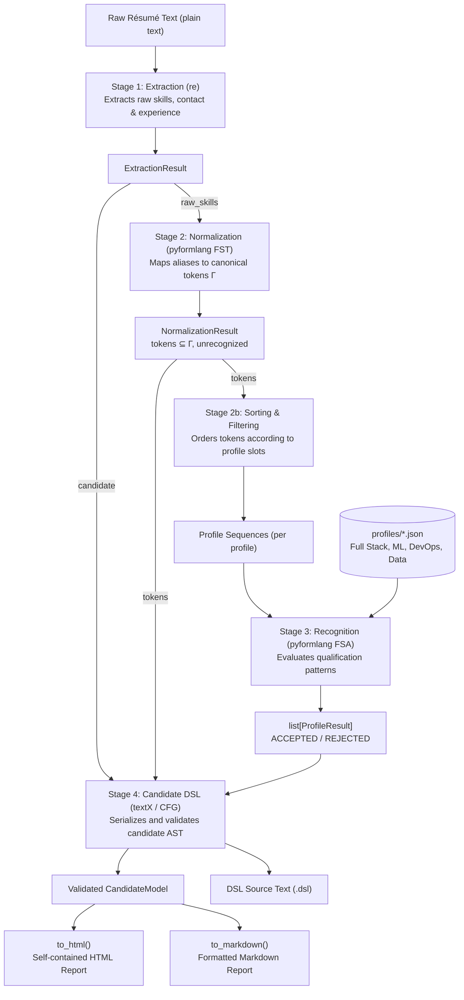
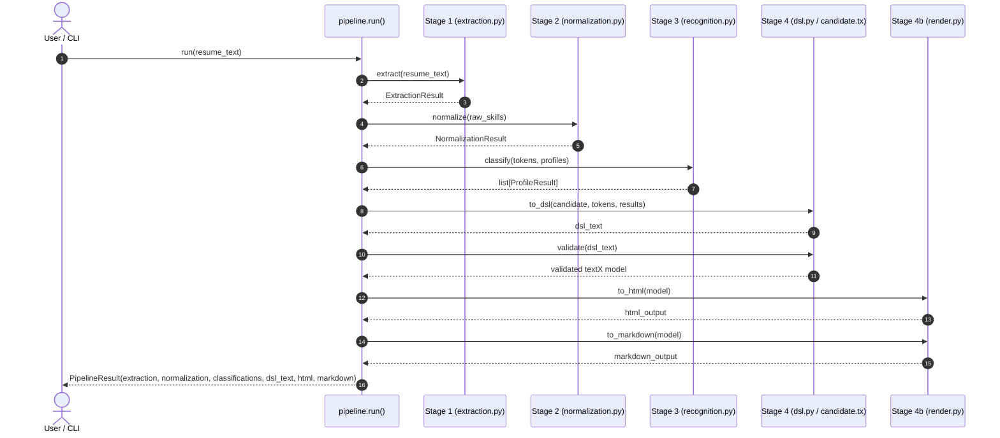

# System Diagrams

This document contains visual diagrams representing the architecture and execution pipeline of ResumeLens.

---

## 1. End-to-End Pipeline Architecture

---

## 2. Sequence Diagram of Pipeline Execution

