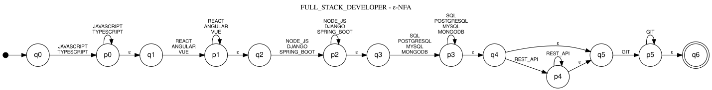
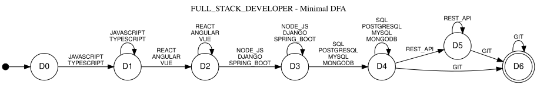
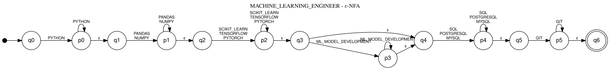
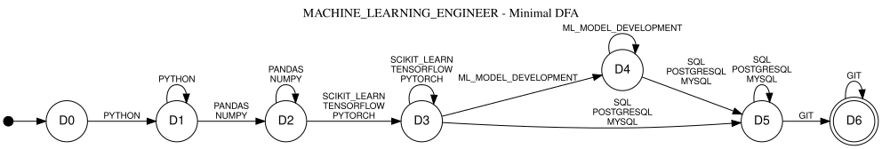

# Formalization

Formal models used by each stage of ResumeLens. Each section is written by the owner of the stage (see `docs/contracts.md`, Section 1).

## Regular Expressions

TODO: implement

## FST - 7 Tuple

TODO: implement

## FSA - 5 Tuple

*Stage 3: qualification pattern recognition. Owner: Diego (Juan Diego Balanta Molina). Code: `src/resumelens/recognition.py`, `src/resumelens/sorting.py`, `profiles/*.json`.*

### 3.1 What the automata decide

Each of the four professional profiles has its own automaton. The automaton reads the canonical tokens of a résumé (output of Stage 2, already filtered and sorted for that profile by Stage 2b) and answers ACCEPTED or REJECTED. A résumé is evaluated against the four profiles independently, so it can be accepted by several of them or by none. The result is binary per profile; it is not a ranking of candidates.

### 3.2 Alphabet

The input alphabet of every automaton is a subset of the canonical vocabulary (`src/resumelens/vocabulary.json`), which is exactly the output alphabet Γ of the Stage 2 transducers. Each canonical token is **one symbol**: `NODE_JS` is a single letter of Σ, not a sequence of characters. For a profile with slots S1, …, Sn,

Σ = S1 ∪ S2 ∪ … ∪ Sn

where Si is the set of tokens of slot i (`any_of`). The sets Si are pairwise disjoint (rule 4 of the profile format), so every symbol belongs to exactly one slot.

Tokens of the résumé that belong to no slot of the profile are removed by Stage 2b before the automaton runs (design decision D5). Without that filter, a Full Stack candidate who also lists Docker would be rejected for knowing *more*, and the alphabet would have to include the whole vocabulary.

### 3.3 Construction and type of the automata

All four automata are produced by the same function, `build_enfa(profile)`, from the ordered list of slots. This keeps the four profiles in one general solution (assignment requirement) and makes the diagrams and tables in this document reproducible: they are generated from the same objects that classify résumés (`scripts/export_diagrams.py`).

**Pattern.** A profile pattern is satisfied when the slots appear in order and every mandatory slot contributes at least one of its tokens; an optional slot may be absent; a slot may contribute several tokens (Mary Jane Watson lists both Pandas and NumPy). Over Σ this is the regular language

L = S1^k1 · S2^k2 · … · Sn^kn,  with ki = `+` if slot i is mandatory and ki = `*` if it is optional.

**States.** For n slots, Q = {q0, …, qn} ∪ {p0, …, p(n-1)}, so |Q| = 2n + 1:

* qi means "the automaton is about to read slot i" (qn means "all slots are done");
* pi means "at least one token of slot i has been read".

**Transitions.** For every slot i and every token t ∈ Si:

* δ(qi, t) ∋ pi: the first token of the slot;
* δ(pi, t) ∋ pi: more tokens of the same slot (loop);
* δ(pi, ε) ∋ q(i+1): the slot is satisfied, move to the next one;
* δ(qi, ε) ∋ q(i+1): only when slot i is optional, skip it.

**Initial and accepting states.** q0 is the initial state and F = {qn}.

**Type: ε-NFA.** The transition relation is δ : Q × (Σ ∪ {ε}) → P(Q) and it contains ε-moves (pi →ε q(i+1) for every slot, and qi →ε q(i+1) for optional slots). A DFA requires δ : Q × Σ → Q, with no ε and exactly one next state, and a plain NFA allows several next states but no ε. Because ε appears in the domain of δ, these automata are ε-NFAs. `automaton_kind()` in the code checks exactly this property on the transition relation.

We use the ε-NFA as the model because it is a direct, slot-by-slot translation of the profile: each slot is a small "one-or-more" gadget joined to the next by ε, and an optional slot is just one extra ε-edge. Adding or editing a profile does not require redrawing anything by hand.

**Equivalent DFA.** By subset construction with ε-closures (`build_dfa`) and minimization (`build_minimal_dfa`) every ε-NFA becomes a minimal DFA; for the four profiles of this project it has n + 1 = 7 states, D0, …, D6 (one state per slot already satisfied). The tests (`tests/test_automata.py`) check with pyformlang that the three automata (ε-NFA, DFA, minimal DFA) accept the same language for the four profiles, and compare them on random and exhaustively enumerated words. Both versions are shown for each profile below.

**Order inside a slot.** The slot loop accepts the tokens of a slot in any order. Stage 2b always delivers them in the order of `any_of`, so the language is slightly larger than the set of sequences that can actually reach the automaton; this keeps the automaton small and does not change any result.

### 3.4 Full Stack Developer (`FULL_STACK_DEVELOPER`)

**Profile pattern.** A Full Stack Developer must show a client-side language, a frontend framework, a backend technology, a database and version control. REST APIs are listed in the assignment as a possible qualification, but the reference résumé (Wednesday Addams) does not mention them and is expected to be accepted, so the API slot is optional.

| Slot | Category | Tokens (`any_of`) | Repetition |
|---|---|---|---|
| 1 | LANGUAGE | `JAVASCRIPT`, `TYPESCRIPT` | mandatory (`+`) |
| 2 | FRONTEND | `REACT`, `ANGULAR`, `VUE` | mandatory (`+`) |
| 3 | BACKEND | `NODE_JS`, `DJANGO`, `SPRING_BOOT` | mandatory (`+`) |
| 4 | DATABASE | `SQL`, `POSTGRESQL`, `MYSQL`, `MONGODB` | mandatory (`+`) |
| 5 | API | `REST_API` | optional (`*`) |
| 6 | VERSION_CONTROL | `GIT` | mandatory (`+`) |

**Language recognized** (regular expression over Σ, `|` = union, `+` = one or more, `*` = zero or more):

```
(JAVASCRIPT | TYPESCRIPT)+ (REACT | ANGULAR | VUE)+ (NODE_JS | DJANGO | SPRING_BOOT)+
(SQL | POSTGRESQL | MYSQL | MONGODB)+ (REST_API)* (GIT)+
```

**Formal definition (ε-NFA).** M = (Q, Σ, δ, q0, F) where

* Q = {q0, q1, q2, q3, q4, q5, q6, p0, p1, p2, p3, p4, p5} (13 states)
* Σ = {JAVASCRIPT, TYPESCRIPT, REACT, ANGULAR, VUE, NODE_JS, DJANGO, SPRING_BOOT, SQL, POSTGRESQL, MYSQL, MONGODB, REST_API, GIT}
* Initial state: q0
* F = {q6}
* δ : Q × (Σ ∪ {ε}) → P(Q) is given by the table below (every pair not listed maps to ∅):

| From | Reads | To |
|---|---|---|
| q0 | `JAVASCRIPT`, `TYPESCRIPT` | p0 |
| p0 | `JAVASCRIPT`, `TYPESCRIPT` | p0 |
| p0 | `ε` | q1 |
| q1 | `REACT`, `ANGULAR`, `VUE` | p1 |
| p1 | `REACT`, `ANGULAR`, `VUE` | p1 |
| p1 | `ε` | q2 |
| q2 | `NODE_JS`, `DJANGO`, `SPRING_BOOT` | p2 |
| p2 | `NODE_JS`, `DJANGO`, `SPRING_BOOT` | p2 |
| p2 | `ε` | q3 |
| q3 | `SQL`, `POSTGRESQL`, `MYSQL`, `MONGODB` | p3 |
| p3 | `SQL`, `POSTGRESQL`, `MYSQL`, `MONGODB` | p3 |
| p3 | `ε` | q4 |
| q4 | `REST_API` | p4 |
| q4 | `ε` | q5 |
| p4 | `REST_API` | p4 |
| p4 | `ε` | q5 |
| q5 | `GIT` | p5 |
| p5 | `GIT` | p5 |
| p5 | `ε` | q6 |

**Transition diagram.**



(Mermaid source: [`diagrams/full_stack_developer_enfa.mmd`](diagrams/full_stack_developer_enfa.mmd); all diagrams are also rendered in [`diagrams/automata.md`](diagrams/automata.md).)

**Equivalent minimal DFA.** Subset construction plus minimization gives 7 states, Q = {D0, D1, D2, D3, D4, D5, D6}, q0 = D0, F = {D6}, δ a partial function Q × Σ → Q (missing pairs go to an implicit dead state):

| From | Reads | To |
|---|---|---|
| D0 | `JAVASCRIPT`, `TYPESCRIPT` | D1 |
| D1 | `JAVASCRIPT`, `TYPESCRIPT` | D1 |
| D1 | `REACT`, `ANGULAR`, `VUE` | D2 |
| D2 | `REACT`, `ANGULAR`, `VUE` | D2 |
| D2 | `NODE_JS`, `DJANGO`, `SPRING_BOOT` | D3 |
| D3 | `NODE_JS`, `DJANGO`, `SPRING_BOOT` | D3 |
| D3 | `SQL`, `POSTGRESQL`, `MYSQL`, `MONGODB` | D4 |
| D4 | `SQL`, `POSTGRESQL`, `MYSQL`, `MONGODB` | D4 |
| D4 | `REST_API` | D5 |
| D4 | `GIT` | D6 |
| D5 | `REST_API` | D5 |
| D5 | `GIT` | D6 |
| D6 | `GIT` | D6 |



**Examples.**

| Sorted sequence (Stage 2b output) | Run of the ε-NFA | Result |
|---|---|---|
| JAVASCRIPT REACT NODE_JS POSTGRESQL GIT (Wednesday Addams) | q0 →JAVASCRIPT p0 →ε q1 →REACT p1 →ε q2 →NODE_JS p2 →ε q3 →POSTGRESQL p3 →ε q4 →ε q5 →GIT p5 →ε q6 | ACCEPTED (q6 ∈ F; the API slot is skipped with q4 →ε q5) |
| TYPESCRIPT REACT VUE DJANGO MYSQL REST_API GIT | two tokens of the frontend slot use the loop p1 →VUE p1 | ACCEPTED |
| JAVASCRIPT REACT GIT (résumé with JS, React.js, Docker, Figma, Git) | after q2 the next symbol is GIT, but q2 only reads backend tokens | REJECTED (no backend, no database) |
| REACT JAVASCRIPT … (unsorted) | q0 has no transition on REACT | REJECTED by the automaton alone; in the pipeline Stage 2b always sorts first, so the candidate's writing order never matters |

### 3.5 Machine Learning Engineer (`MACHINE_LEARNING_ENGINEER`)

**Profile pattern.** A Machine Learning Engineer must show Python, at least one data-processing library, at least one machine-learning library, a SQL database and version control. "Machine-learning model development" is a listed qualification, but neither the reference résumé (Mary Jane Watson) nor the example automaton of the assignment requires it as a separate token, so that slot is optional. MongoDB is not part of this profile (the assignment asks for SQL).

| Slot | Category | Tokens (`any_of`) | Repetition |
|---|---|---|---|
| 1 | LANGUAGE | `PYTHON` | mandatory (`+`) |
| 2 | DATA_LIB | `PANDAS`, `NUMPY` | mandatory (`+`) |
| 3 | ML_LIB | `SCIKIT_LEARN`, `TENSORFLOW`, `PYTORCH` | mandatory (`+`) |
| 4 | ML_PRACTICE | `ML_MODEL_DEVELOPMENT` | optional (`*`) |
| 5 | DATABASE | `SQL`, `POSTGRESQL`, `MYSQL` | mandatory (`+`) |
| 6 | VERSION_CONTROL | `GIT` | mandatory (`+`) |

**Language recognized** (regular expression over Σ, `|` = union, `+` = one or more, `*` = zero or more):

```
(PYTHON)+ (PANDAS | NUMPY)+ (SCIKIT_LEARN | TENSORFLOW | PYTORCH)+ (ML_MODEL_DEVELOPMENT)*
(SQL | POSTGRESQL | MYSQL)+ (GIT)+
```

**Formal definition (ε-NFA).** M = (Q, Σ, δ, q0, F) where

* Q = {q0, q1, q2, q3, q4, q5, q6, p0, p1, p2, p3, p4, p5} (13 states)
* Σ = {PYTHON, PANDAS, NUMPY, SCIKIT_LEARN, TENSORFLOW, PYTORCH, ML_MODEL_DEVELOPMENT, SQL, POSTGRESQL, MYSQL, GIT}
* Initial state: q0
* F = {q6}
* δ : Q × (Σ ∪ {ε}) → P(Q) is given by the table below (every pair not listed maps to ∅):

| From | Reads | To |
|---|---|---|
| q0 | `PYTHON` | p0 |
| p0 | `PYTHON` | p0 |
| p0 | `ε` | q1 |
| q1 | `PANDAS`, `NUMPY` | p1 |
| p1 | `PANDAS`, `NUMPY` | p1 |
| p1 | `ε` | q2 |
| q2 | `SCIKIT_LEARN`, `TENSORFLOW`, `PYTORCH` | p2 |
| p2 | `SCIKIT_LEARN`, `TENSORFLOW`, `PYTORCH` | p2 |
| p2 | `ε` | q3 |
| q3 | `ML_MODEL_DEVELOPMENT` | p3 |
| q3 | `ε` | q4 |
| p3 | `ML_MODEL_DEVELOPMENT` | p3 |
| p3 | `ε` | q4 |
| q4 | `SQL`, `POSTGRESQL`, `MYSQL` | p4 |
| p4 | `SQL`, `POSTGRESQL`, `MYSQL` | p4 |
| p4 | `ε` | q5 |
| q5 | `GIT` | p5 |
| p5 | `GIT` | p5 |
| p5 | `ε` | q6 |

**Transition diagram.**



(Mermaid source: [`diagrams/machine_learning_engineer_enfa.mmd`](diagrams/machine_learning_engineer_enfa.mmd); all diagrams are also rendered in [`diagrams/automata.md`](diagrams/automata.md).)

**Equivalent minimal DFA.** Subset construction plus minimization gives 7 states, Q = {D0, D1, D2, D3, D4, D5, D6}, q0 = D0, F = {D6}, δ a partial function Q × Σ → Q (missing pairs go to an implicit dead state):

| From | Reads | To |
|---|---|---|
| D0 | `PYTHON` | D1 |
| D1 | `PYTHON` | D1 |
| D1 | `PANDAS`, `NUMPY` | D2 |
| D2 | `PANDAS`, `NUMPY` | D2 |
| D2 | `SCIKIT_LEARN`, `TENSORFLOW`, `PYTORCH` | D3 |
| D3 | `SCIKIT_LEARN`, `TENSORFLOW`, `PYTORCH` | D3 |
| D3 | `ML_MODEL_DEVELOPMENT` | D4 |
| D3 | `SQL`, `POSTGRESQL`, `MYSQL` | D5 |
| D4 | `ML_MODEL_DEVELOPMENT` | D4 |
| D4 | `SQL`, `POSTGRESQL`, `MYSQL` | D5 |
| D5 | `SQL`, `POSTGRESQL`, `MYSQL` | D5 |
| D5 | `GIT` | D6 |
| D6 | `GIT` | D6 |



**Examples.**

| Sorted sequence (Stage 2b output) | Run of the ε-NFA | Result |
|---|---|---|
| PYTHON PANDAS NUMPY SCIKIT_LEARN TENSORFLOW SQL GIT (Mary Jane Watson) | q0 →PYTHON p0 →ε q1 →PANDAS p1 →NUMPY p1 →ε q2 →SCIKIT_LEARN p2 →TENSORFLOW p2 →ε q3 →ε q4 →SQL p4 →ε q5 →GIT p5 →ε q6 | ACCEPTED (two data libraries and two ML libraries are read by the slot loops) |
| PYTHON PANDAS TENSORFLOW POSTGRESQL GIT (assignment, Stage 3 example) | same path with one token per slot | ACCEPTED |
| PYTHON PANDAS SQL GIT | in q2 the next symbol is SQL, but q2 only reads ML libraries | REJECTED (no ML library) |

> Sections 3.6 (DevOps Engineer), 3.7 (Data Engineer) and 3.8 (design discussion and limitations) are added in the next revision.


## EBNF

TODO: implement
